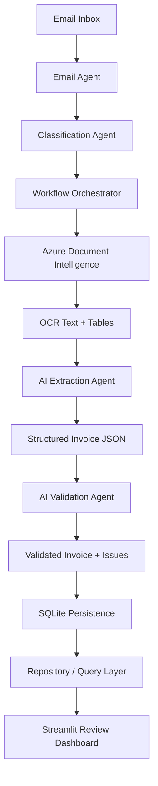
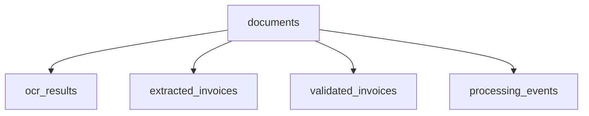

# Enterprise AI Invoice Processing & Validation Platform

**Python · Azure Document Intelligence · OpenAI GPT-4o-mini · SQLite · Streamlit**

> An enterprise-inspired Intelligent Document Processing (IDP) platform for automating invoice ingestion, OCR, structured data extraction, validation, storage, and human review.

---

## 🎯 Business Problem

Finance teams often spend significant time downloading invoices, extracting financial information, validating totals, and preparing data for downstream ERP processes.

This project automates the early stages of invoice processing by combining **Azure Document Intelligence** for OCR with **GPT-based extraction and validation**, while preserving auditability and human oversight.

---

## ✨ Key Features

- Email-based invoice ingestion
- AI document classification for **Invoice / Purchase Order / Goods Receipt**
- Azure Document Intelligence OCR and table extraction
- GPT-powered structured invoice extraction
- Dedicated AI validation layer with anti-hallucination guardrails
- SHA-256 duplicate document detection
- SQLite persistence for OCR, extracted, and validated results
- Processing event audit trail
- Human-in-the-loop approval and rejection workflow
- Streamlit review dashboard

---

## 🏗️ System Architecture



The **Workflow Orchestrator** coordinates the processing sequence. It does not perform OCR, extraction, or validation itself; instead, it calls the appropriate module at each stage and persists the results.

---

## 🔄 Processing Workflow

1. **Email ingestion** — unread emails are scanned and PDF attachments are downloaded.
2. **Classification** — documents are classified as Invoice, PO, GRN, or Unknown.
3. **Document registration** — the file is registered and hashed using SHA-256.
4. **OCR** — Azure Document Intelligence extracts page text and table structure.
5. **AI extraction** — GPT-4o-mini converts OCR output into structured invoice JSON.
6. **AI validation** — extracted values are checked for consistency and validation issues.
7. **Persistence** — OCR, extracted, validated, and audit-event data are stored in SQLite.
8. **Human review** — users review the final result in Streamlit and approve or reject the invoice.

---

## 🧠 AI Processing Design

The project deliberately separates **extraction** from **validation**.


This separation reduces the risk of a single model both extracting and silently correcting financial data without an independent validation stage.

The validator also applies programmatic guardrails that prevent unsupported changes such as:

- adding or removing line items
- inventing invoice numbers
- inventing missing totals
- silently changing authoritative printed totals

---

## 🔬 Document AI Model Evaluation

During development, multiple document-processing approaches were evaluated,
including **Amazon Textract, GPT Vision, and Azure AI Document Intelligence**.

Across the invoice samples used during development, **Azure AI Document
Intelligence produced the most consistent extraction quality**, particularly
for invoice structure, OCR text, and tabular line-item data. It was therefore
selected as the primary document-processing layer.

The final solution uses a hybrid approach:

**Azure Document Intelligence → OCR & Table Extraction → GPT-4o-mini →
Structured Invoice JSON → Validation**

Azure handles document structure and OCR, while GPT-4o-mini normalizes the
extracted information into a consistent invoice schema for downstream
validation and processing.

> **Note:** Model selection was based on development testing against the
> invoice samples used in this project and is not intended as a general
> benchmark of the evaluated services.

---

## 🧩 Enterprise Design Decisions

| Design Decision | Reason |
|---|---|
| **Azure Document Intelligence** | Reliable OCR with structured table extraction |
| **GPT-4o-mini** | Semantic interpretation of invoice content |
| **Separate extraction and validation** | Improves reliability and reduces hallucination risk |
| **SHA-256 file hashing** | Prevents duplicate document registration |
| **Separate OCR / extracted / validated records** | Preserves processing traceability |
| **Audit event logging** | Makes document lifecycle events visible and debuggable |
| **SQLite persistence** | Lightweight local database suitable for the current project scope |
| **Human review dashboard** | Keeps final financial approval under user control |

---

## 🛠️ Technology Stack

| Layer | Technology | Purpose |
|---|---|---|
| Application | Python | Workflow and business logic |
| OCR | Azure Document Intelligence | Text and table extraction |
| AI | OpenAI GPT-4o-mini | Structured extraction and validation |
| Database | SQLite | Persistent invoice and audit data |
| UI | Streamlit | Human review dashboard |
| Email | IMAP | Incoming email and attachment retrieval |
| Configuration | python-dotenv | Environment-variable management |

---

## 📁 Project Structure

```text
enterprise-ai-invoice-processing/
│
├── azure_invoice_ocr.py
├── classify_agent.py
├── email_agent.py
├── extractor_agent.py
├── Orchestrator.py
├── storage_agent.py
├── ui_app.py
├── validator_agent.py
│
├── Invoice 1.pdf
├── Invoice 2.pdf
├── Invoice 3.pdf
│
├── images/
│   ├── dashboard_review.png
│   ├── dashboard_success.jpg
│   └── database_schema.png
│
├── README.md

```

> If your screenshot file extensions differ, update the image links below so they match the exact filenames in your repository.

---

## 📊 Dashboard

The Streamlit application provides an operational review layer for processed invoices.

### Successful Validation


### Invoice Requiring Review


### SQLite Database


The dashboard displays invoice counts, validation results, structured invoice data, and manual **Approve / Reject** actions.

---

## 🗃️ Data Model

The persistence layer separates the document lifecycle into dedicated tables:



- **documents** — document identity, hash, type, status, and received timestamp
- **ocr_results** — OCR provider, raw text, and extracted tables
- **extracted_invoices** — structured invoice JSON generated by the extraction agent
- **validated_invoices** — validated JSON, issues, and final validation status
- **processing_events** — document processing audit history

---

## 💼 Business Applications

This architecture can support invoice-processing workflows in organizations such as:

- Manufacturing
- Third-Party Logistics (3PL)
- Distribution
- Retail
- Construction
- Healthcare supply operations
- Accounting and finance service providers
- Shared Service Centers
- Business Process Outsourcing (BPO)

It is especially relevant where invoices arrive through email and employees manually extract, validate, and prepare invoice data for downstream financial systems.

> **Current scope:** invoice processing and validation. Automated PO matching, Goods Receipt matching, three-way reconciliation, and ERP posting are **not currently implemented**.

---

## 🚀 Getting Started

### 1. Install Dependencies

```bash
pip install -r requirements.txt
```

### 2. Configure Environment Variables

Create a `.env` file:

```text
OPENAI_API_KEY=
AZURE_FORMREC_ENDPOINT=
AZURE_FORMREC_KEY=
EMAIL_USER=
EMAIL_PASS=
EMAIL_HOST=
```

Do **not** commit your real `.env` file or credentials to GitHub.

### 3. Run the Processing Pipeline

```bash
python Orchestrator.py
```

### 4. Launch the Dashboard

```bash
streamlit run ui_app.py
```

---

## 🧪 Sample Documents

The repository includes sample invoice PDFs that can be used to demonstrate the processing pipeline:

- `Invoice 1.pdf`
- `Invoice 2.pdf`
- `Invoice 3.pdf`

Use only anonymized or synthetic documents in a public repository.

---

## 🗺️ Future Roadmap

- Purchase Order matching
- Goods Receipt processing
- Three-way invoice matching
- ERP integration (for example SAP or Oracle)
- REST API using FastAPI
- PostgreSQL or managed cloud database
- Azure cloud deployment
- Confidence-based exception routing
- Multi-language invoice processing
- Multi-currency validation

---

## ⚠️ Scope & Production Considerations

This project demonstrates an enterprise-inspired IDP architecture but is not presented as a production-ready financial system.

A production deployment would typically require additional capabilities such as authentication, authorization, secrets management, observability, concurrency controls, retry handling, secure cloud storage, database migrations, automated testing, and ERP integration.

---

## 📄 License

This project is intended for educational, research, and portfolio use. Add the license of your choice before reuse or distribution.
